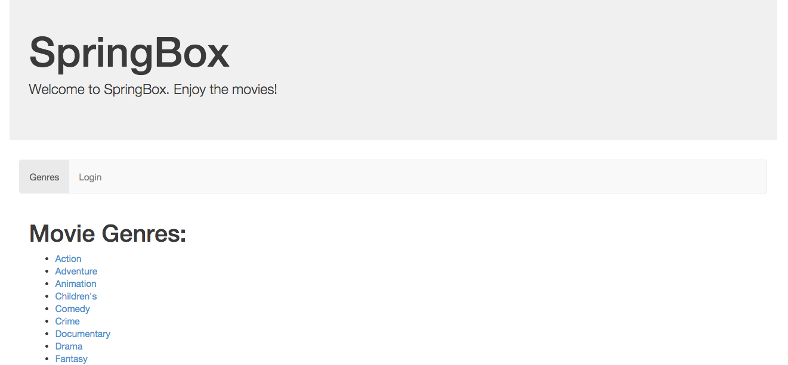

= SpringBox Reference Application

== Running Locally

. Clone the repo.

. Import the root `pom.xml` into your favorite IDE or run `mvn package`.

. Download and install the following services:
.. https://www.rabbitmq.com/download.html[RabbitMQ]
.. https://www.mongodb.org/downloads[MongoDB]
.. http://neo4j.com/download/other-releases/[Neo4J Community Edition] - version 2.1.x - Cypher changes won't make it possible to work with 2.2.x

. Either from the IDE or the command line (i.e. `java -jar target/appname.jar`), run the applications in the following order:
.. `springbox-config-server`
.. `springbox-eureka`
.. `springbox-auth-server`
.. `springbox-catalog`
.. `springbox-reviews`
.. `springbox-recommendations`
.. `springbox-api-gateway`

. Load data into the reviews DB by running `springbox-reviews/scripts/loadReviews.sh`.

. Load data into the recommendations DB by running `springbox-recommendations/scripts/loadGraph.sh`.

. Visit http://localhost:9000 and you should see something like the following:
+

